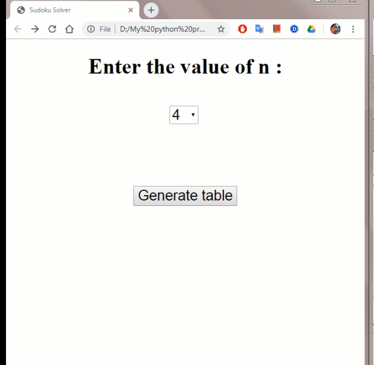
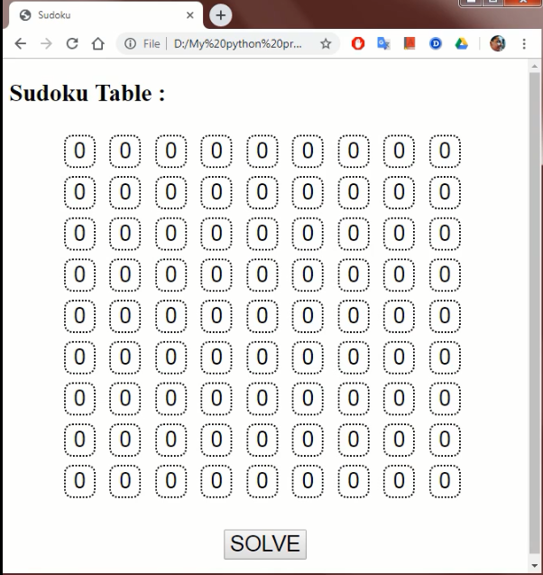
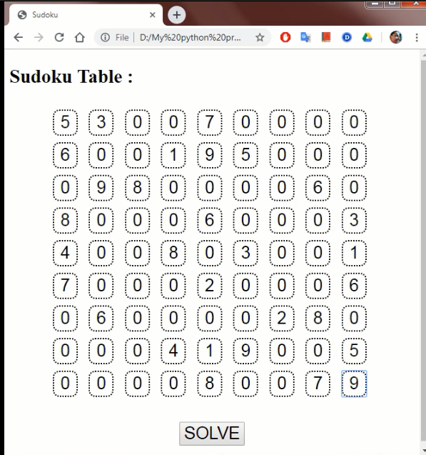
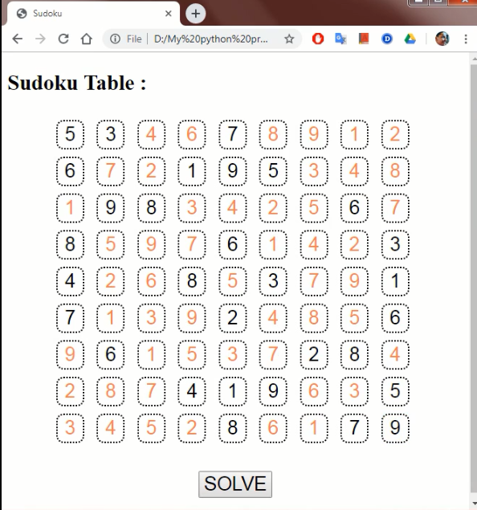

## Sudoku-Solver
This project is made to solve sudoku puzzles of different sizes 

You first have to open mainPage.html and the grid size selector screen appears

Then select the grid size

Then start filling the grid

Then Press the SOLVE button

Here is an example

